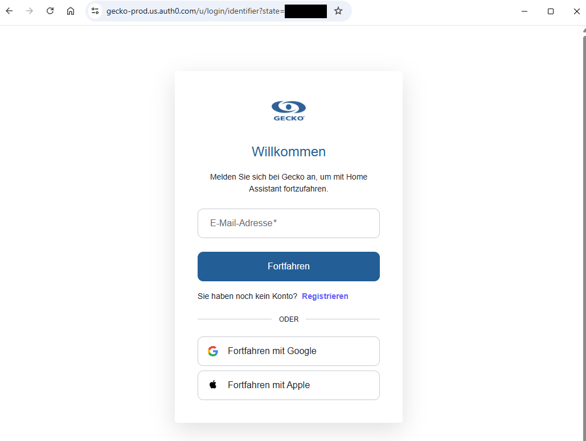
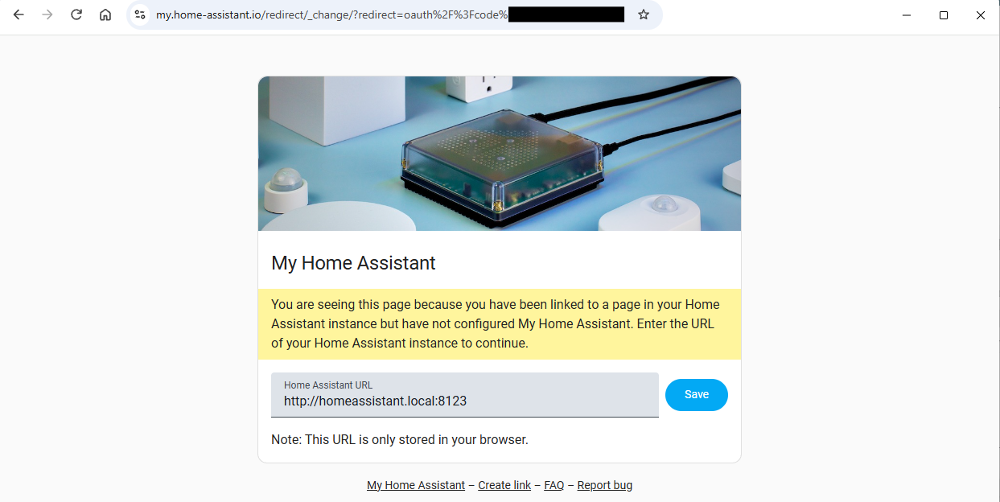

# gecko-pool-mqtt

Standalone Python bridge between a Gecko in.touch 3 pool controller and a local
MQTT broker.

The service uses `gecko-iot-client` to connect to the Gecko cloud and exposes the
data locally through a second, independent MQTT client:

- Gecko cloud: the library's internal AWS IoT MQTT connection
- Local broker: MQTT connection to `MQTT_HOST` under the `gecko/` topic prefix

## Architecture

```text
Gecko Cloud / AWS IoT
        │ gecko-iot-client
        ▼
   PoolController
        │ paho-mqtt
        ▼
Local MQTT broker
        │
      gecko/#
```

## Prerequisites

- Docker and Docker Compose
- Access to the local MQTT broker
- Gecko account and pool controller
- An MQTT client such as `mosquitto_pub` and `mosquitto_sub` for the initial login

To run the bridge without Docker, or to look up pinned dependency versions and
the threading rules, see [`development.md`](development.md).

## Quick Start

1. Clone the repository and create your configuration:

   ```text
   git clone https://github.com/ActronX/gecko-pool-mqtt.git
   cd gecko-pool-mqtt
   copy .env.example .env
   ```

   On Linux and macOS use `cp .env.example .env` instead of `copy`.

2. Edit `.env`. At minimum set `MQTT_HOST` to the hostname of your broker, plus
   `MQTT_USERNAME` and `MQTT_PASSWORD` if it requires authentication. The default
   `mqtt.example.com` does not exist. Set `GECKO_HEAT_PUMP_FLOW_ZONE_ID` only if
   an external heat pump is connected. Every variable is listed in
   [Configuration](#configuration).

3. Build and start the container:

   ```text
   docker compose up -d --build
   docker compose logs -f gecko-mqtt
   ```

   The service publishes no ports and expects a broker that is already running.

4. Log in to Gecko over MQTT. Follow [OAuth Login over MQTT](#oauth-login-over-mqtt)
   for the browser step, and watch the result:

   ```text
   mosquitto_sub -h mqtt.example.com -t "gecko/auth/status" -v
   ```

   This step is done once `{"status":"authenticated"}` arrives.

5. Switch a pump on for the first time. Look up the zone ID first, because it is
   not part of the display name:

   ```text
   mosquitto_sub -h mqtt.example.com -t 'gecko/status/zone/flow/+' -v
   ```

   Then send the command and watch the acknowledgement:

   ```text
   mosquitto_pub -h mqtt.example.com -t gecko/cmd/flow/4/set -m '{"action":"on"}'
   mosquitto_sub -h mqtt.example.com -t 'gecko/cmd/flow/4/result' -v
   ```

   `4` is an example, use the ID from above. `success: true` means the desired
   state reached the Gecko connection; confirm the applied state on the retained
   status topic.
   
## Configuration

Copy the configuration template:

```text
copy .env.example .env
```

Important settings in `.env`:

| Variable | Default | Description |
|---|---:|---|
| `MQTT_HOST` | `mqtt.example.com` | Hostname of the local broker |
| `MQTT_PORT` | `1883` | Port of the local broker |
| `MQTT_BASE_TOPIC` | `gecko` | Prefix for all bridge topics |
| `MQTT_CLIENT_ID` | `gecko-pool-mqtt` | MQTT client ID |
| `MQTT_SHUTDOWN_PUBLISH_TIMEOUT` | `2.0` | Time to wait during shutdown until retained `offline` is confirmed |
| `MQTT_USERNAME` | empty | Optional username |
| `MQTT_PASSWORD` | empty | Optional password |
| `OAUTH_TOKEN_FILE` | `/data/tokens.json` | Persistent token path |
| `GECKO_ACCOUNT_ID` | empty | Optional: skip account discovery |
| `GECKO_MONITOR_ID` | empty | Optional: force vessel selection |
| `GECKO_CONFIG_TIMEOUT` | `30.0` | Timeout for the Gecko configuration |
| `GECKO_HEAT_PUMP_FLOW_ZONE_ID` | `4` | Flow zone ID of the pump used for external heat pumps |
| `GECKO_HEAT_PUMP_DEFAULT_DURATION` | `30` | Default runtime of the heat-pump request in minutes |
| `GECKO_HEAT_PUMP_MAX_REASSERT_ATTEMPTS` | `2` | Maximum failed reassert attempts before the emergency stop; `0` = unlimited |
| `GECKO_HEAT_PUMP_CHECK_INTERVAL` | `5.0` | Heat-pump watchdog check interval in seconds |
| `GECKO_HEAT_PUMP_CONFIRM_TIMEOUT` | `15.0` | Maximum wait for the activation confirmation in seconds |
| `LOG_LEVEL` | `INFO` | Python log level |

The registered OAuth redirect URL is:
`https://my.home-assistant.io/redirect/oauth`.

Do not treat `GECKO_OAUTH2_CLIENT_ID` as a secret: it is Gecko Alliance's
public PKCE client without a client secret, the same one used by the official
Home Assistant integration
[`geckoal/ha-gecko-integration`](https://github.com/geckoal/ha-gecko-integration).
PKCE replaces the client secret with a cryptographic code challenge, so the value
does not need protection. It is a code default so the service runs after a
`git clone` without an additional step. If you registered a custom client,
override the variable in `.env`.   

### Configuration Validation Is Not Fatal

`app/main.py` calls `settings.validate()`, logs any errors found, and then
starts the service **anyway**. Validation is therefore advisory, not enforced.
Specific consequence for heat pump timings:

- If `GECKO_HEAT_PUMP_CONFIRM_TIMEOUT` is smaller than
  `GECKO_HEAT_PUMP_CHECK_INTERVAL`, validation reports this with
  `GECKO_HEAT_PUMP_CONFIRM_TIMEOUT must be at least GECKO_HEAT_PUMP_CHECK_INTERVAL`,
  but the service continues running. Practical effect: The confirmation deadline
  may already have expired at the first watchdog check, causing an earlier
  reassert than intended.
- Likewise, `GECKO_HEAT_PUMP_CHECK_INTERVAL <= 0` and
  `GECKO_HEAT_PUMP_MAX_REASSERT_ATTEMPTS < 0` are only reported, not prevented.

Anyone who intentionally sets tight timings should consciously ignore the warning
in the log (`Configuration errors: ...`).

It is also checked that `GECKO_HEAT_PUMP_CONFIRM_TIMEOUT` is at least 5
seconds. This is not an arbitrary limit: The library's zone methods wait up to
5 seconds for the PUBACK acknowledgment. A reassert can therefore remain in the
call for 5 seconds, and with a smaller window the confirmation deadline expires
during the call, causing the watchdog to reassert again even though Gecko could
not yet respond. The value belongs to the library, not the bridge;
`tests/test_library_contract.py` pins the version it comes from.

## OAuth Login over MQTT

The PKCE login requires a running process because the code verifier and
state are kept only in memory.

1. Start the service and wait for `gecko/auth/challenge`.
2. Open the `authorize_url` value from the retained challenge in a browser.
3. Log in to Gecko.

   

4. After the redirect, copy the complete URL from the browser address bar.

   

5. Send the URL to `gecko/auth/response`:

```text
mosquitto_pub -h mqtt.example.com -t gecko/auth/response -m "https://my.home-assistant.io/redirect/_change/?redirect=oauth%2F%3Fcode%3D...%26state%3D..."
```

Alternatively, `gecko/auth/response` accepts JSON:

```json
{"redirect_url":"https://my.home-assistant.io/redirect/oauth?code=...&state=..."}
```

Or directly:

```json
{"code":"...","state":"..."}
```

After successful login:

- `gecko/auth/status` becomes `{"status":"authenticated",...}`
- `gecko/auth/challenge` is deleted as an empty retained message
- Zone and connectivity statuses are published

A new login challenge can be requested at any time:

```text
mosquitto_pub -h mqtt.example.com -t gecko/auth/login -m ""
```

## MQTT Topics

All topics start with `gecko/` by default. With a different
`MQTT_BASE_TOPIC`, replace this prefix accordingly.

### Authentication

| Topic | Direction | Retained | Payload |
|---|---|---:|---|
| `gecko/auth/status` | Bridge → Broker | Yes | JSON with `status` and `reason` |
| `gecko/auth/challenge` | Bridge → Broker | Yes | JSON with `authorize_url`, `state`, `instructions` |
| `gecko/auth/response` | Broker → Bridge | No | Redirect URL or JSON code/state. An empty payload is ignored, it does not attempt a login |
| `gecko/auth/login` | Broker → Bridge | No | Any payload; creates a new challenge |

Possible auth status values are `login_required`, `authenticating`,
`authenticated`, and `reauth_required`.

An invalid `auth/response` reports `login_required` only while no valid session
exists. With a valid session the status stays `authenticated` and the reason
carries the diagnostic, so `auth/status` cannot contradict
`gecko/status/connectivity`. Note that `auth/status` is written only on
transitions: after a restart it reads `authenticated` only once the connection
has been established, and it is not revised during an outage. Use
`connectivity` as the connection indicator.

### Status

Status messages are JSON and are published retained.

| Topic | Payload |
|---|---|
| `gecko/status/availability` | `online` or `offline` |
| `gecko/status/connectivity` | Gecko connectivity data plus auth fields |
| `gecko/status/operation_mode` | Current Watercare/Operation mode |
| `gecko/status/zone/temperature/<zone_id>` | Temperature zone with current and target value |
| `gecko/status/zone/lighting/<zone_id>` | Lighting zone with activity, color, and effect |
| `gecko/status/zone/flow/<zone_id>` | Flow zone with activity, speed, run reason, and presets |
| `gecko/status/zones` | Complete snapshot by zone type |
| `gecko/status/heatPump/state` | Heat pump request state |

Example of a temperature zone:

```json
{
  "id": "zone-1",
  "name": "Pool",
  "type": "temperature",
  "state": {
    "current_temperature": 27.5,
    "target_temperature": 28.0,
    "status": "READY",
    "eco_mode": false,
    "min_set_point": 15.0,
    "max_set_point": 40.0
  }
}
```

Example of `gecko/status/heatPump/state`:

```json
{
  "state": "waiting_confirmation",
  "zone_id": "4",
  "armed": true,
  "error_count": 0,
  "max_errors": 2,
  "remaining_seconds": 1794,
  "timestamp": "2026-09-30T06:30:00+00:00"
}
```

| Field | Meaning |
|---|---|
| `state` | `disarmed`, `waiting_confirmation`, `running`, `disconnected`, `error`, or `disarmed_expired` |
| `zone_id` | Flow zone ID in use |
| `armed` | `true` while the controller wants to keep the zone active |
| `error_count` | Failed reassert/confirmation attempts for the current request |
| `max_errors` | Value of `GECKO_HEAT_PUMP_MAX_REASSERT_ATTEMPTS`; `0` = emergency stop disabled |
| `remaining_seconds` | Remaining time in **seconds**, otherwise `null` |
| `timestamp` | UTC timestamp of publication |

Units: `remaining_seconds` is in seconds, while the `duration` field of the
`gecko/cmd/heatPump` command and `GECKO_HEAT_PUMP_DEFAULT_DURATION` are in
**minutes**. For `disarmed`, `error`, and `disarmed_expired`,
`remaining_seconds` is `null`.

An emergency stop always results in `error` with `armed: false`, regardless of
whether it was triggered by the confirmation timeout or the offline branch.

`state` and `armed` never contradict each other: `disarmed`, `error`, and
`disarmed_expired` correspond to `armed: false` with `remaining_seconds: null`,
while `waiting_confirmation`, `running`, and `disconnected` correspond to
`armed: true` with remaining time.

The topic is published retained. While the watchdog is running, it is also
updated in every `GECKO_HEAT_PUMP_CHECK_INTERVAL` cycle – **exactly once per
cycle**, not multiple times with an identical payload. A state change within a
cycle, such as `disconnected` to `running`, is additionally published
immediately. A new `active: true` when `running` is already active is **not** a
state change and is therefore not published again – Gecko provides zone updates
for all zones, and otherwise every switch of light or pump 1 would produce an
additional `running` line.
The state transitions and error cases are
described in
[`heatpump_sm.md`](heatpump_sm.md).

The two heat pump events `gecko/status/heatPump/reassert` and
`gecko/status/heatPump/error`, by contrast, are **not** retained and are
therefore not included in this table.

### Pump Run Reason

Flow zones contain the initiator codes supplied by Gecko in the
`state.initiators` field. `state.initiator_labels` additionally provides
readable names. This makes it especially clear whether a pump is running because
of a filter cycle or a cooldown.

| Code | Label | Meaning |
|---|---|---|
| `FI` | `filtration` | Filter cycle |
| `CD` | `cooldown` | Cooldown / cooling cycle |
| `HT` | `heating` | Heating |
| `HTP` | `heat_pump` | Heat pump |
| `PU` | `purge` | Flush/purge cycle |
| `CF` | `checkflow` | Flow check |
| `UD` | `user_demand` | Manual user demand |

Example, with the fields in the order the bridge emits them:

```json
{
  "id": "1",
  "name": "Pump 1",
  "type": "flow",
  "state": {
    "active": true,
    "speed": 100,
    "initiators": ["FI"],
    "initiator_labels": ["filtration"],
    "capabilities": ["supports_turn_off", "supports_turn_on"],
    "supports_speed_percentage": false,
    "supports_turn_on": true,
    "supports_turn_off": true,
    "speed_config": null,
    "presets": []
  }
}
```

When multiple causes occur simultaneously, multiple entries are transmitted, for
example `initiators: ["HT", "FI"]`. The codes intentionally remain in the
payload so the values can be traced unambiguously to the Gecko app. Unknown
codes are labeled `unknown:<code>`.

The flow status also contains the hardware capabilities:

```json
{
  "capabilities": ["supports_turn_off", "supports_turn_on"],
  "supports_speed_percentage": false,
  "supports_turn_on": true,
  "supports_turn_off": true,
  "speed_config": null
}
```

For a pump with `supports_speed_percentage: false`, no `speed` value may be
sent. The bridge rejects such a command with `success: false` and a
corresponding error message. For a pure on/off pump, the correct
command is:

```json
{"action":"on"}
```

A variable-speed pump additionally provides a `speed_config`, for example:

```json
{
  "supports_speed_percentage": true,
  "speed_config": {
    "minimum": 20,
    "maximum": 100,
    "stepIncrement": 10
  }
}
```

This command is then valid, for example:

```json
{"action":"on","speed":20}
```

### Commands

Commands are sent as JSON to `gecko/cmd/+/+/set`. For each command, the bridge
publishes a response under
`gecko/cmd/<type>/<zone_id>/result`.

Temperature:

```text
mosquitto_pub -h mqtt.example.com -t gecko/cmd/temperature/zone-1/set -m '{"target_temperature":28.0}'
```

Turn lighting off, sent to `gecko/cmd/lighting/<zone_id>/set`:

```json
{"action":"off"}
```

Turn lighting on, sent to `gecko/cmd/lighting/<zone_id>/set`:

```json
{"action":"on"}
```

Note that `on` and `off` take different paths. `off` calls `deactivate()` and
therefore works on every lighting zone. `on` calls `set_color` with `r`, `g` and
`b` defaulting to `255`, so it needs a zone that supports colour. A plain
`{"action":"on"}` is therefore the same as white light and may be rejected with
`success: false`. The lighting payload carries no capability flags, so there is
no way to tell in advance; the retained `gecko/status/zone/lighting/<zone_id>`
only shows `active`, `color` and `effect`.

Turn flow on, sent to `gecko/cmd/flow/<zone_id>/set`:

```json
{"action":"on"}
```

A `speed` value may only be added when the flow zone reports
`supports_speed_percentage: true` in its status. For a variable-speed pump:

```json
{"action":"on","speed":50}
```

For an on/off pump the speed value must be omitted:

```json
{"action":"on"}
```

If a `speed` value is nevertheless sent to a non-variable-speed pump, the bridge
responds under the respective `result` topic with `success: false`, for example:

```json
{
  "success": false,
  "message": "Flow zone 1 supports on/off only; speed percentage is not supported",
  "zone_id": "1"
}
```

### Example: A Pump Stays On During a Filter Cycle

The zone ID is not necessarily part of the display name, so look up the flow
zones first:

```text
mosquitto_sub -h mqtt.example.com -t 'gecko/status/zone/flow/+' -v
```

For a complete list of all zones grouped by type see `gecko/status/zones`, shown
under [Status](#status).

If the fourth pump has the ID `4`, switch it off:

```text
mosquitto_pub -h mqtt.example.com -t gecko/cmd/flow/4/set -m '{"action":"off"}'
```

What happens next depends on **why** the pump is running.

**It runs because you asked for it**, indicated by `UD`. The zone goes inactive:

```json
{
  "id": "4",
  "name": "Pump 4",
  "type": "flow",
  "state": {
    "active": false,
    "speed": 100,
    "initiators": [],
    "initiator_labels": [],
    "capabilities": ["supports_turn_off", "supports_turn_on"],
    "supports_speed_percentage": false,
    "supports_turn_on": true,
    "supports_turn_off": true,
    "speed_config": null,
    "presets": []
  }
}
```

**It runs a filter cycle**, indicated by `FI`. The pump keeps running:

```json
{
  "id": "4",
  "name": "Pump 4",
  "type": "flow",
  "state": {
    "active": true,
    "speed": 100,
    "initiators": ["FI"],
    "initiator_labels": ["filtration"],
    "capabilities": ["supports_turn_off", "supports_turn_on"],
    "supports_speed_percentage": false,
    "supports_turn_on": true,
    "supports_turn_off": true,
    "speed_config": null,
    "presets": []
  }
}
```

A filter cycle belongs to the pool controller, not to you. A user-level off
request cannot override an automatic cycle, so the zone stays active until the
cycle ends and the pump stops on its own.

`gecko/cmd/heatPump` deliberately does the opposite and switches the zone back
on whenever the pool controller reports it inactive, because an external heat
pump needs that flow. See [External Heat Pumps](#external-heat-pumps).

Do not rely on the ack to notice any of this.
`gecko/cmd/flow/4/result` only reports that the desired state was handed to the
Gecko connection:

```json
{"success":true,"message":"Flow command applied","zone_id":"4"}
```

While a filter cycle runs, that result can still report `success: true` and the
zone still stays active, because the pool controller overrode the request. If it
rejects the request instead, the result carries `success: false` together with
the message the library returned. **For the pump both cases mean the same thing:
it keeps running.** Confirm the applied state on the retained topic:

```text
mosquitto_sub -h mqtt.example.com -t 'gecko/status/zone/flow/4' -v
```

## External Heat Pumps

Two kinds of pool need different things here.

**Gecko runs the heat pump.** The in.touch system knows the heat pump, controls
it itself, and switches it with the heating cycle. Nothing below applies, and
`gecko/cmd/heatPump` is not used.

**The heat pump is external and unknown to Gecko.** This is the common case, and
it is the reason the command exists. While the pool is heated, heat has to be
carried off again, which requires the circulation flow to keep running. Gecko
does not know the heat pump and therefore cannot react to what it needs.

`gecko/cmd/heatPump` closes that gap. It holds one flow zone on for at least a
given runtime, so water keeps moving and the external heat pump can deliver its
heat. The zone is taken from `GECKO_HEAT_PUMP_FLOW_ZONE_ID`, which defaults to
`4`; see `.env.example`. It has to be the zone wired to the heat pump's flow
loop.

While a request is armed, a watchdog watches that zone. Whenever it drops, the
bridge switches it back on and reports the attempt on
`gecko/status/heatPump/reassert`. That covers most reasons, because gecko-pool-mqtt is not
the only party that can stop a pump:

- a pool filter cycle ends and the `FI` initiator is removed
- the pump is switched off by hand in the Gecko Android / Apple app
- the zone reports inactive for any other reason coming from Gecko

> **The external heat pump still needs its own safety shutdown.** The command
> only toggles one flow zone in the Gecko cloud, and every link in that chain can
> fail: the Gecko connection, the implementation behind it, or the bridge itself.
> A restart discards the request completely and leaves the pump off until
> something sends `on` again. The watchdog is a convenience, not a guarantee. Keep
> the heat pump's own flow and temperature protection in place, and never let
> this command be the only thing between a fault and the equipment.

### Commands and Payloads

The command deliberately uses its own topic `gecko/cmd/heatPump`
(without `/set`):

```powershell
mosquitto_pub -h mqtt.example.com -t gecko/cmd/heatPump -m '{"action":"on","duration":30}'
```

`duration` is specified in minutes. If `duration` is omitted,
`GECKO_HEAT_PUMP_DEFAULT_DURATION` is used (30 minutes by default).
Further `on` commands extend the active request but do not shorten it.

A running request can be stopped immediately:

```powershell
mosquitto_pub -h mqtt.example.com -t gecko/cmd/heatPump -m '{"action":"off"}'
```

The result is published under `gecko/cmd/heatPump/result`. Example of a
successful `on` ack:

```json
{"success":true,"message":"Heat-pump pump request active","action":"on","zone_id":"4","duration":32,"remaining_seconds":1920,"state":"running"}
```

| Field | Meaning |
|---|---|
| `success` | `true` if the request was armed |
| `message` | Short plain-text result |
| `action` | `on` or `off` |
| `zone_id` | Flow zone ID used |
| `duration` | Requested minimum runtime in **minutes** |
| `remaining_seconds` | Remaining runtime in **seconds** |
| `state` | State produced by **this** command: `running` for an already active zone, otherwise `waiting_confirmation` |

`state` deliberately describes the command transition, not the state before it.
Therefore, an `on` immediately after a restart reports `waiting_confirmation`
or `running`, never the initial state's `disarmed`.

### A Restart Discards the Request

After a bridge restart, **no** heat-pump request is
resumed. The controller starts `disarmed`, no watchdog runs, and it does not
reconstruct anything from the cloud state. Specifically:

- `gecko/status/heatPump/state` reports `disarmed` once with `armed: false`
  and `remaining_seconds: null`.
- Until a new `on` has been received, the controller ignores every zone update.
  Switching the pump off through the Gecko app also triggers **no** reassert,
  because `_observe_zone_update` exits when `not self._armed`.
- An initiator still set in the cloud remains in place. Shutdown deliberately
  sends **no** `deactivate()`, so maintenance does not cut off a running filter
  cycle. The zone then reports `armed: false` while the pump is running,
  indistinguishable in `status/heatPump/state` from "the pump is intentionally
  off".
- The pump remains off until the calling automation sends again. With a
  30-minute interval and `duration: 32`, this means up to 30 minutes without
  heat-pump flow.

To verify this without waiting for the next filter cycle:

```text
mosquitto_pub -h mqtt.example.com -t gecko/cmd/heatPump -m '{"action":"on","duration":10}'
docker compose restart
mosquitto_sub -h mqtt.example.com -t "gecko/status/heatPump/#" -v -W 20
```

Exactly one `state` line with `disarmed` is expected, followed by nothing else.
Now switch the pump off through the app: there must be **no** `reassert`.
The automation's next `on` switches it on again.

Both behaviors are intentional and are deliberately not being fixed because
each solution would introduce its own failure mode:

- **Reconstruct the deadline from retained state.** Read
  `gecko/status/heatPump/state` at startup and re-arm with the remaining
  `remaining_seconds` when `armed: true`. No additional file is needed, but this
  survives only while the retained topic is not deleted and produces an already
  expired request after a long outage.
- **Persist the request alongside the tokens on `/data`.** Write the command,
  deadline, and `error_count` on `on`; delete them on `stop`, `off`, expiration,
  and emergency stop. This also survives `docker compose down` and a rebuild,
  but requires the same persistence maintenance as `tokens.json`.

### Reassert and Error Events

Each reassert attempt or failed confirmation attempt is published as a
non-retained event under `gecko/status/heatPump/reassert`:

```json
{
  "timestamp": "2026-09-28T11:38:22.123456+00:00",
  "zone_id": "4",
  "reason": "zone became inactive",
  "initiators": [],
  "attempt": 1,
  "activate_called": true,
  "activate_error": null,
  "confirmed": false
}
```

`attempt` corresponds to the error counter for the current heat-pump request.
It is `0` on the first reassert while no error has yet been counted, and
increases from the first confirmed error onward. The first `action: on` does
not count as a reassert. With an existing Gecko connection, `activate()` is
called again (`activate_called: true`). This also applies when the Gecko
connection is currently unconfirmed, because the client may buffer the desired
state or transmit it later. An error that occurred is recorded in
`activate_error`; a `null` only means that the method call returned
successfully. `active: true` must still be confirmed afterward. An attempt is
confirmed only by a subsequent `gecko/status/zone/flow/<zone_id>` update with
`state.active: true`; the counter is then reset. The watchdog check and regular
publication of `gecko/status/heatPump/state` run at the interval specified by
`GECKO_HEAT_PUMP_CHECK_INTERVAL`.

`confirmed` is `true` when Gecko has already confirmed activation during the
blocking `activate()` call, before the zone-update callback could run on the
event loop. The controller then reports `running` directly and never
`waiting_confirmation` for a zone that is already running. In all other cases,
`confirmed: false` remains set, and confirmation follows through the
zone update.

Confirmation relies exclusively on `state.active`, without checking the
initiator. Activity from `FI` or `CD` therefore also counts as confirmation.
Details and limitations are documented in
[`heatpump_sm.md`](heatpump_sm.md) under *Limits of the Activity Check*.

Possible values for `reason`:

| `reason` | Trigger |
|---|---|
| `zone became inactive` | Watchdog check: zone inactive despite `armed` |
| `zone reported inactive` | Zone update with `active: false` during an active request |
| `activation not confirmed within confirm_timeout` | `active: true` did not arrive in time; `activate_called: false` |
| `activate failed: <exception>` | The `activate()` call itself raised an exception |
| `gecko disconnected` | Watchdog check without a complete Gecko connection |
| `watchdog exception: <exception>` | Error during watchdog or zone lookup |

With a disconnected Gecko connection, `activate()` is not called. Instead, the
`disconnected` state is published and the offline error counter is incremented
at most once per watchdog cycle. This is also counted when the client is
completely absent. These errors count toward
`GECKO_HEAT_PUMP_MAX_REASSERT_ATTEMPTS` and can trigger an emergency stop; with
`GECKO_HEAT_PUMP_MAX_REASSERT_ATTEMPTS=0`, no emergency stop occurs.
Two details matter during an outage: Reconnecting does **not** reset the error
counter; only a confirmation, `off`, or a new `on` does. An unstable connection
can therefore continue the emergency stop. The state remains `disconnected`
until then.

Reassert events can be observed with this command:

```powershell
mosquitto_sub -h mqtt.example.com -t 'gecko/status/heatPump/reassert' -v
```

If the pump remains inactive after the configured number of failed reassert
attempts, the bridge terminates the internal heat-pump request as an emergency
stop and publishes one non-retained error event under
`gecko/status/heatPump/error`. With
`GECKO_HEAT_PUMP_MAX_REASSERT_ATTEMPTS=0`, the emergency stop remains disabled and
the bridge continues trying indefinitely:

```json
{
  "timestamp": "2026-09-28T11:39:22.123456+00:00",
  "zone_id": "4",
  "error": "emergency_stop",
  "reason": "Pump not confirmed after 2 attempts: activation not confirmed within confirm_timeout",
  "attempts": 2,
  "initiators": []
}
```

`reason` always has the form `Pump not confirmed after <n> attempts: <trigger>`.
The `<trigger>` part is one of the `reason` values from the
reassert table above; in this example, it is the expired
confirmation deadline.

The error event can be received only if the subscriber is already subscribed
before the emergency stop because it is published as non-retained:

```powershell
mosquitto_sub -h mqtt.example.com -t 'gecko/status/heatPump/error' -v
```

The reassert counter is reset on `active: true`, `action: off`, expiration of
the request, or a new request. An emergency stop terminates the current
request; a later `action: on` starts a new count.

The complete state machine, status payloads, and error transitions are in
[`heatpump_sm.md`](heatpump_sm.md).

### Switching on Solar Surplus

`gecko/cmd/heatPump` is a plain MQTT command, so anything that can publish can
trigger it. [FusionForecast](https://github.com/ActronX/fusionForecast) does that
for solar power: its Node-RED flow switches a consumer on only when the forecast
covers the runtime without draining the home battery below a reserved level.
Point it at `gecko/cmd/heatPump` and the heat pump runs on solar surplus.

## MQTT Trace

To analyze operating histories without an external recorder, the bridge writes
every message it processes as one JSON line per day in
`MQTT_TRACE_DIR`. This covers outgoing messages – status, acks, and events –
as well as incoming commands. The trace is a passive observer and does not
alter the flow.

| Variable | Default | Meaning |
|---|---|---|
| `MQTT_TRACE_DIR` | `/tmp/mqtt` | Target directory. Empty or `off` disables tracing. |
| `MQTT_TRACE_RETENTION_DAYS` | `7` | Retention in days. `0` keeps everything. |

`docker-compose.yml` binds `/tmp/mqtt` to `./mqtt-trace` in the project directory.
Without this mount, the file would be in the container's writable layer and
would be accessible only via `docker cp`. The directory is excluded in `.gitignore`.

Example of a line:

```json
{"ts":"2026-05-04T11:02:49.076556+00:00","dir":"out","topic":"gecko/status/heatPump/reassert","payload":"{\"reason\":\"zone reported inactive\"}","qos":1,"retain":false}
```

| Field | Meaning |
|---|---|
| `ts` | UTC timestamp with microseconds |
| `dir` | `in` for received, `out` for sent |
| `topic` | Complete topic including the base prefix |
| `payload` | Payload as raw text, not reformatted |
| `qos`, `retain` | Only with `dir: out` |
| `bytes` | Only with `auth/response`: length of the redacted payload |

The payload of `auth/response` contains the OAuth code from the redirect and is
replaced with `<redacted>`. The message continues unchanged; only the recording
is truncated.

Files are named `mqtt-YYYY-MM-DD.jsonl` and rotate at midnight UTC. On each
rotation, older files are deleted according to `MQTT_TRACE_RETENTION_DAYS`.
With the default `GECKO_HEAT_PUMP_CHECK_INTERVAL=20`, about 2 MB are created per
day, or about 14 MB with seven days of retention.

### Analysis

All state changes of the heat-pump controller in chronological order:

```powershell
jq.exe -r 'select(.topic=="gecko/status/heatPump/state") | "\(.ts) \(.payload|fromjson|.state)"' mqtt-trace/mqtt-2026-09-30.jsonl
```

Find duplicate publications of the same state line, meaning two
lines less than one second apart:

```powershell
jq.exe -r 'select(.topic=="gecko/status/heatPump/state") | .ts' mqtt-trace/mqtt-2026-09-30.jsonl
```

What the bridge received while the filter cycle was running:

```powershell
jq.exe -r 'select(.dir=="in") | "\(.ts) \(.topic) \(.payload)"' mqtt-trace/mqtt-2026-09-30.jsonl
```

## Troubleshooting

### `login_required` Remains Active

Read the challenge, open the URL in a browser, and send the full redirect URL
back to `gecko/auth/response`. Generate a new challenge:

```text
mosquitto_pub -h mqtt.example.com -t gecko/auth/login -m ""
```

### `reauth_required`

The refresh token was rejected or has expired. A new challenge is
published automatically. After a successful login, the existing
tokens are replaced.

### `offline` or No MQTT Status

Check broker reachability, `MQTT_HOST`, `MQTT_PORT`, and optional credentials.
The bridge uses MQTT reconnects. The Last Will topic marks an unexpected
connection loss as `offline`.

If `status/availability` remains `online` after a clean stop, check whether the
service actually shut down normally. A forced container stop or a crash is not
covered by the Last Will because it is published only after an unexpected
connection loss. During an orderly shutdown, the bridge waits up to
`MQTT_SHUTDOWN_PUBLISH_TIMEOUT` seconds for confirmation of the retained
`offline` message before disconnecting. Integration test `TC-INT-05-01` checks
exactly this case.

### No Zone Status Data

First check `gecko/status/connectivity`. The Gecko IoT connection is established
in a daemon thread and may need some time for initial configuration after a
successful OAuth login.

After an error during the initial Gecko connect, the bridge automatically tries
to reconnect. The wait increases from five seconds to a maximum of five
minutes. Meanwhile, the local MQTT broker remains available and
`gecko/auth/status` remains `authenticating` until the Gecko connection and
configuration have been loaded successfully.

After a successful connect, the `gecko-iot-client` transport also handles
reconnection, including JWT refresh and backoff. An invalid refresh token
instead leads to `reauth_required` and a new OAuth challenge. The
wait sequence and limits are documented
under
[Connection and Reconnect](development.md#connection-and-reconnect).

### Flow Command Is Not Executed

First check whether the zone has the specified ID and is fully
connected:

```text
mosquitto_sub -h mqtt.example.com -t 'gecko/status/zone/flow/+' -v
mosquitto_sub -h mqtt.example.com -t gecko/status/connectivity -v
```

For a pump without speed control, use only this command:

```text
mosquitto_pub -h mqtt.example.com -t gecko/cmd/flow/1/set -m '{"action":"on"}'
```

If `speed` is sent, the flow status must first contain
`supports_speed_percentage: true`. The response is published to:

```text
gecko/cmd/flow/1/result
```

With Docker, the bridge reception and Gecko forwarding logs can be
checked:

```text
docker compose logs -f gecko-mqtt
```

These log entries are expected (strings exactly as in the code):

| Log entry | Source | Meaning |
|---|---|---|
| `Connected to local MQTT broker` | `app/mqtt_bridge.py` | Connection to the local broker is established |
| `Received local MQTT message` | `app/mqtt_bridge.py` | Message has arrived |
| `Dispatching command` | `app/mqtt_bridge.py` | Command was validated and forwarded |
| `Dispatching heatPump command` | `app/mqtt_bridge.py` | Heat-pump command was forwarded |
| `Handling flow/control command` | `app/pool_controller.py` | Command is being processed |
| `Gecko client ready for command` | `app/pool_controller.py` | Gecko is connected; command is sent to the library |
| `Applying flow command` | `app/pool_controller.py` | Flow command is applied to the zone |
| `GeckoIotClient connected successfully` | `app/pool_controller.py` | Gecko Cloud connection is established |
| `Command failed` | `app/pool_controller.py` | Command failed, `result` with `success: false` |

If `Received local MQTT message` is already missing, the broker, topic prefix,
or sender's MQTT credentials do not match the bridge. If `Gecko client ready for
command` is missing, the Gecko connection is not ready yet. If
`GeckoIotClient connect failed: ...; retrying in Ns` appears, reconnect backoff
is active (5 seconds to a maximum of 5 minutes).

## Validation

How the bridge is tested, the concurrency and library-contract checks, and the
manual smoke tests are documented in
[`tests/validation.md`](tests/validation.md).

The requirements and the test cases that refer to them live in
[`REQUIREMENTS.md`](REQUIREMENTS.md).

Dependencies, local development, thread boundaries, and connection handling are
documented in [`development.md`](development.md).

