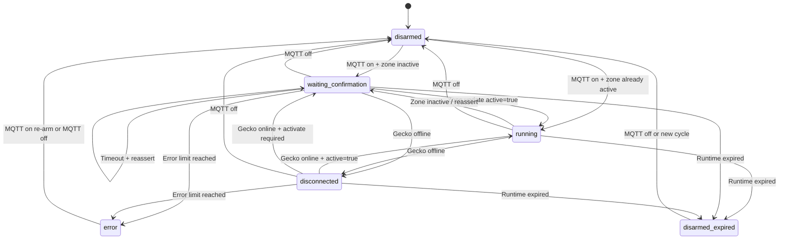

# Heat-Pump State Machine

This document describes the controller for the external heat pump and its
associated Gecko flow zone.

## Overview

The controller keeps a flow zone active for a limited time. `activate()` only
sets the desired state in Gecko. The actual activation is confirmed
asynchronously by a Gecko zone update with `active: true`.

The asyncio event loop processes all state changes. MQTT commands originate in
the paho-MQTT thread and are forwarded to the event loop. Gecko zone updates
originate in the Gecko thread and are forwarded to the event loop as well.

The zone methods in `gecko-iot-client` 1.0.3 are synchronous and internally wait
up to five seconds for PUBACK confirmation. `activate()` and `deactivate()` are
therefore executed through `await asyncio.to_thread(...)`. The call blocks a
worker thread, not the event loop. A Gecko call can outlive a task that has
already been cancelled; late return values are discarded if the controller has
since been disarmed.

## Confirmation While the Blocking Call Is In Flight

`activate()` returns as soon as Gecko acknowledges the command. The actual
activation is not yet confirmed at that point; confirmation arrives as a zone
update. The library sets `zone.active` in its own thread before
`client.on(ZONE_UPDATE)` marshals the callback to the event loop. There is a
window between these points in which `zone.active` is already `true` but the
zone-update callback has not yet run.

The controller therefore checks `zone.active` again after every blocking
`activate()` and before publishing `waiting_confirmation`:

- `zone.active` is `true`: The activation is confirmed. Pending and the
  deadline are cleared, `error_count` is reset, the reassert is reported with
  `confirmed: true`, and state `running` is published.
- `zone.active` is `false`: The controller publishes
  `waiting_confirmation` as before and waits for confirmation through the zone
  update callback.

Without this check, the controller would report `waiting_confirmation` for a
running zone when the zone update arrived during the blocking call. This
regularly occurs at the end of a filtration cycle: Gecko confirms the
reactivation while `activate()` is still waiting for PUBACK.

The zone-update callback can also process the confirmation while `activate()`
is running. In that case, the older watchdog compares the reassert deadline
with its own value, and the reassert ends without publishing anything.


## Meaning of `is_connected`

The watchdog checks `client.is_connected`. The library supplies
`is_fully_connected` for this purpose, meaning the MQTT transport **and** the
gateway **and** the vessel. A failed cloud login therefore counts as an error,
just like a transport failure.

The library transport, not the bridge, handles connection loss during
operation. After a disconnect, it reconnects automatically with five attempts
and backoff of 1, 2, 4, 8, and 16 seconds; instead of giving up, it then starts
a cooldown with a forced token refresh. The bridge retry loop applies only to
the initial connection. See *Connection Setup and Reconnect* in the README for
details.

## Limits of the Activity Check

The controller evaluates **only** `zone.active`. It does **not** check which
initiator caused the activity.

This means:

- `active: true` confirms the request regardless of the initiator. Activity
  caused by `FI` (filtration) or `CD` (cooldown) also counts as confirmation.
- Conversely, `active: false` causes a reassert even when the heat-pump
  initiator itself is no longer set, for example because Gecko logic switched
  off the pump.

This is an intentional simplification: the zone API does not expose initiator
semantics to the bridge, and initiator-specific confirmation would trigger a
reassert during an `FI`-driven pump run even though the pump is running. As a
result, state `running` does not guarantee that `UD` or `HTP` is currently set.
To check the actual initiator, read `state.initiators` from
`geeko/status/zone/flow/<zone_id>`.

## States

The `state` string in `geeko/status/heatPump/state` can have the following values:

| State | Meaning |
|---|---|
| `disarmed` | No active heat-pump request. The watchdog is not running. |
| `waiting_confirmation` | `activate()` was sent; `active: true` is still expected. |
| `running` | The zone was confirmed active. |
| `disconnected` | The controller is armed, but Gecko is not fully connected. |
| `error` | The configured error limit was reached; the controller was disarmed. |
| `disarmed_expired` | The configured runtime expired; the controller was disarmed. |

`armed` is a separate Boolean field in the payload. It indicates whether the
controller continues trying to keep the zone active. The two fields always
agree: `disarmed`, `error`, and `disarmed_expired` have `armed: false` and
`remaining_seconds: null`; the three armed states have `armed: true` and a
remaining runtime.

The watchdog task is created before the command's state name is set, so it runs
exactly once while `activate()` is still blocked. In this window, the state is
by definition `waiting_confirmation`; the watchdog explicitly sets it to that
value so it does not publish the constructor's previous value. Before the fix,
one cycle reported
`{"state": "disarmed", "armed": true, "remaining_seconds": 1919}`.



## MQTT Commands

Topic:

```text
geeko/cmd/heatPump
```

Request the heat pump for 33 minutes:

```json
{"action":"on","duration":33}
```

Without `duration`, the controller uses `GECKO_HEAT_PUMP_DEFAULT_DURATION`. The
duration is specified in minutes.

End the request:

```json
{"action":"off"}
```

A new `on` command resets the expiration to at least the requested duration
from the time of the new command. Runtimes are not added. If the existing
remaining runtime is longer, it is not shortened.

## Status Payload

Topic:

```text
geeko/status/heatPump/state
```

The status is published retained. With an active watchdog, it is also published
after every `GECKO_HEAT_PUMP_CHECK_INTERVAL` cycle, **exactly once per cycle**.
A cycle sets the state internally and publishes it once at the end; a reassert
that publishes its own state suppresses publication at the end of the cycle.
State changes are published immediately.

Only a change in the state name counts as a state change. A repeated
`active: true` while `running` is already active does not, and is therefore not
published. Gecko sends zone updates for all zones and often sends several in
quick succession; without this rule, every tap in the app would produce
another `running` publish.

The published `state` never contradicts `armed` or `remaining_seconds`:
`disarmed` appears only with `armed: false` and `remaining_seconds: null`;
`waiting_confirmation`, `running`, and `disconnected` appear only with
`armed: true` and a remaining runtime.

The `state` field of the command acknowledgment on
`geeko/cmd/heatPump/result` is the state produced by the command, not the
previous state. An `on` immediately after a restart therefore reports
`waiting_confirmation` or `running`, not the initial `disarmed` state.

```json
{
  "state": "running",
  "zone_id": "4",
  "armed": true,
  "error_count": 0,
  "max_errors": 3,
  "remaining_seconds": 1742,
  "timestamp": "2026-09-30T06:30:00+00:00"
}
```

`remaining_seconds` is always in seconds. `GECKO_HEAT_PUMP_DEFAULT_DURATION`
and the command's `duration` field, by contrast, are in minutes. For
`disarmed`, `error`, and `disarmed_expired`, `remaining_seconds` is `null`.

## Confirmation and Watchdog

Configure the values in `.env`:

```env
GECKO_HEAT_PUMP_CHECK_INTERVAL=20.0
GECKO_HEAT_PUMP_CONFIRM_TIMEOUT=30.0
```

- The watchdog checks the Gecko connection and zone status every 20 seconds.
- After `activate()`, it waits at most 30 seconds for `active: true`.
- An asynchronous zone update with `active: true` confirms immediately and does
  not wait for the next watchdog cycle.
- While `waiting_confirmation` or `disconnected`, the retained state is also
  updated regularly.

The confirmation timeout must be at least as large as the check interval:

```text
GECKO_HEAT_PUMP_CONFIRM_TIMEOUT >= GECKO_HEAT_PUMP_CHECK_INTERVAL
```

`app/config.py` checks this rule. A violation is **not fatal**:
`app/main.py` logs `Configuration errors: ...` and starts the service anyway.
If the confirmation timeout is too short, the deadline may already have
expired at the first watchdog check, causing an earlier-than-intended reassert.

## Errors and Reasserts

Each relevant error increments `error_count` and creates a non-retained event
on:

```text
geeko/status/heatPump/reassert
```

The following are counted in particular:

- Gecko is not fully connected during the watchdog check.
- The activation is not confirmed within the confirmation timeout.
- `zone.activate()` raises an exception.
- A watchdog or zone-lookup error occurs.

The `reason` field in the payload contains the triggering text:

| `reason` | Trigger |
|---|---|
| `zone became inactive` | Watchdog check: zone inactive despite `armed` |
| `zone reported inactive` | Zone update with `active: false` during an active request |
| `activation not confirmed within confirm_timeout` | `active: true` did not arrive in time; `activate_called: false` |
| `activate failed: <exception>` | The `activate()` call itself raised |
| `gecko disconnected` | Watchdog check without a complete Gecko connection |
| `watchdog exception: <exception>` | Watchdog or zone-lookup error |

`confirmed` is `true` when Gecko confirmed the activation during the blocking
`activate()` call; see *Confirmation While the Blocking Call Is In Flight*.
The reassert then reports `confirmed: true` and state `running`. Otherwise, the
field is `false`, and confirmation follows through the zone update.

Set the limit with `GECKO_HEAT_PUMP_MAX_REASSERT_ATTEMPTS`:

```env
GECKO_HEAT_PUMP_MAX_REASSERT_ATTEMPTS=3
```

When the limit is reached, the controller publishes a non-retained event on:

```text
geeko/status/heatPump/error
```

The controller is then disarmed and state `error` is published. This applies
to every trigger, including the offline branch. The emergency stop deliberately
sends no `zone.deactivate()`; the zone remains in its last requested Gecko
state. The `reason` of the error event has the form
`Pump not confirmed after <n> attempts: <reason>`, where `<reason>` is one of the
reassert reasons listed above.

If the emergency stop is triggered through the offline branch, the watchdog
cycle ends immediately with `error`. After reconnecting without prior
confirmation, the state remains `disconnected`, because the last set value is
still published in the absence of an actual state change.

The value `0` disables the emergency stop based on the error count:

```env
GECKO_HEAT_PUMP_MAX_REASSERT_ATTEMPTS=0
```

The controller then continues indefinitely as long as the runtime has not
expired and no `off` command or process shutdown occurs.

## Expired Runtime and Shutdown

When the monotonic expiration deadline is reached:

1. `armed` is set to `false`.
2. The watchdog is stopped.
3. `zone.deactivate()` is sent best effort.
4. The retained state `disarmed_expired` is published.

The MQTT `off` command and process shutdown publish state `disarmed`. If Gecko
is unreachable at expiration, the deactivation is only logged; the controller
still stops monitoring.
